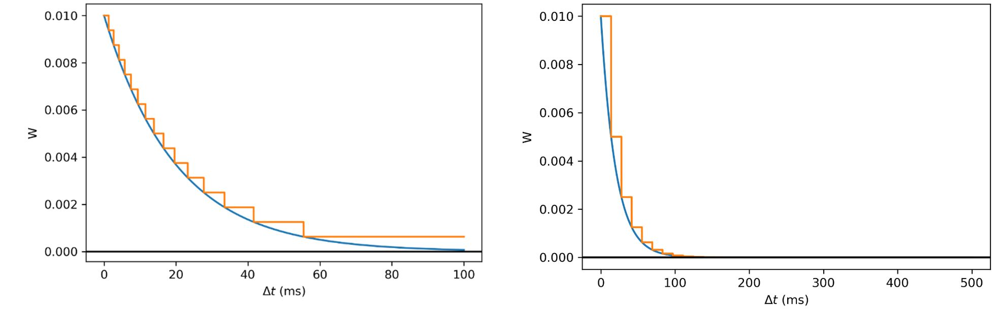

## StepSTDP
<p align="center"></p>
StepSTDP is a new improved STDP algorithm for SNN training, which has good feasibility in hardware implementation.
It quantify the W-Delta_t curve (which is the blue exponential curve in the top image) to the step curve (orange curve in the top image). The left image is a linear-cut quantization while the right image is a nonlinear-cut quantization. W is propotional to the weight change value. Delta_t is the time interval between presynaptic neurons and postsynaptic neurons.  

## Requirements
- Python 3.6
- BindsNET package installed (To install the package, visit [BindsNET](https://github.com/Hananel-Hazan/bindsnet))
## Setting things up
Change the current directory to BindsNET installation directory.
```
cd bindsnet-master
```
Copy the "experiment" folder to this directory.

## Getting started
To run an instance with StepSTDP algorithm, replace the following Python statements in examples\mnist\eth_mnist.py 
```
from bindsnet.models import DiehlAndCook2015
network = DiehlAndCook2015(n_inpt=784, n_neurons=n_neurons, exc=exc, inh=inh, dt=dt, norm=78.4, theta_plus=1)
```
to
```
from experiment.models import Dafeng2019
network = Dafeng2019(n_inpt=784, n_neurons=n_neurons, exc=exc, inh=inh, dt=dt, norm=78.4, theta_plus=1,Non_linear=True)
```
issue the following to run the instance:
```
cd bindsnet
python ..\examples\mnist\eth_mnist.py
```
If you encounter a problem, please check the path setting first and feel free to contact [me](mailto:dafhuang@outlook.com)

